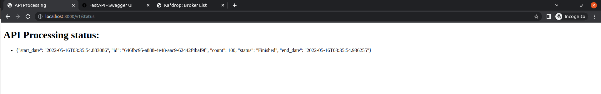
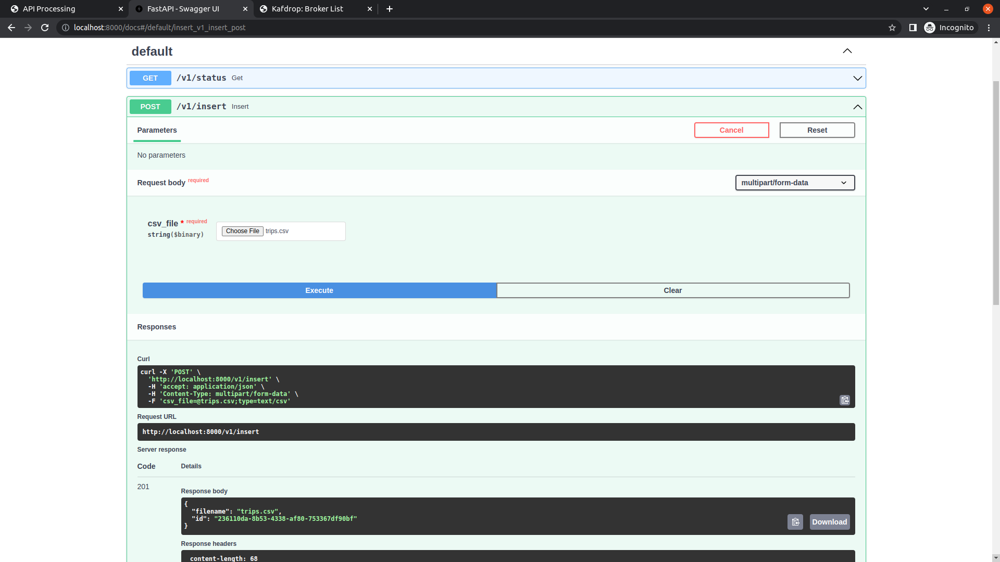
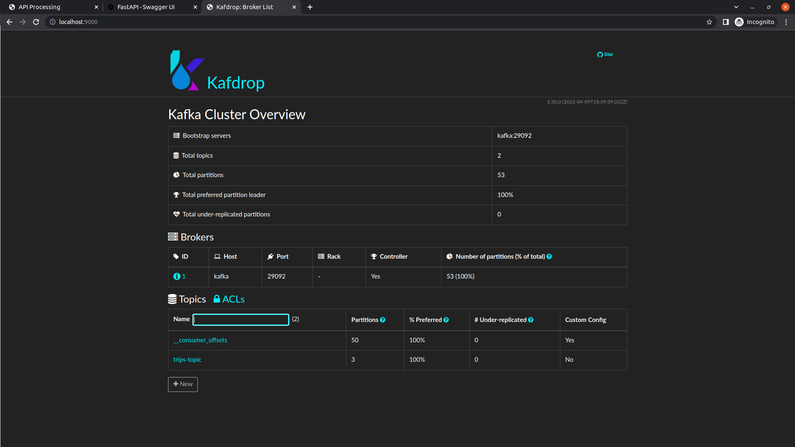

# Data Engineering Challenge

## Mandatory features

- [x] There must be an automated process to ingest and store the data.
- [X] Trips with similar origin, destination, and time of day should be grouped together.
- [ ] Develop a way to obtain the weekly average number of trips for an area, defined by a
bounding box (given by coordinates) or by a region.
- [x] Develop a way to inform the user about the status of the data ingestion without using a
polling solution.
- [x] The solution should be scalable to 100 million entries. It is encouraged to simplify the
data by a data model. Please add proof that the solution is scalable.
- [x] Use a SQL database.

## Mandatory features

- [x] Containerize your solution.
- [ ] Sketch up how you would set up the application using any cloud provider (AWS, Google
Cloud, etc).
- [X] Include a .sql file with queries to answer these questions:
    * [x] From the two most commonly appearing regions, which is the latest datasource?
    * [x] What regions has the "cheap_mobile" datasource appeared in?

## Services

### api

Developed using FastAPI using async functions and processes requests as streams keeping the memory usage low.

### Kafka and Kafdrop

The project uses Kafka as a message broker and Kafdro to monitor the topics.

### PostgreSQL

The database used in the project is PostgreSQL with [Postgis](https://postgis.net/) and [H3: Uber’s Hexagonal Hierarchical Spatial Index](https://eng.uber.com/h3/) extensions. 
- Postgis for GIS operations
- H3 to compute the origin and destination groupping

### Consumer

Kafka Python consumer, responsible for inserting data into PostgreSQL. 

## Clone Repository

```bash
git clone git@github.com:andertadashi/trips-challenge.git
```


## Start Services

```bash
cd trips-challenge
docker-compose up -d --build && docker-compose logs -f 
```

## API's


### Processing Status API

This endpoint [http://localhost:8000/v1/status](http://localhost:8000/v1/status) connects to the server and receive the update about the insertion status. It uses a WebSocket and is update in realtime. 

- start_date: start date
- id: unique per request
- count: lines processed
- status: Processing, Finished, and Error
- end_date: null for processing, and contains the date it finished

```json
{
    "start_date": "2022-05-16T03:35:54.883086", 
    "id": "646fbc95-a888-4e48-aac9-62442f4baf9f", 
    "count": 100, 
    "status": "Finished", 
    "end_date": "2022-05-16T03:35:54.936255"
}
```



### Insert Data API

This endpoint [http://localhost:8000/v1/insert](http://localhost:8000/v1/insert) send a file to be processed.

File sample [trips.csv](data/files/trips.csv):
```
region,origin_coord,destination_coord,datetime,datasource
Prague,POINT (14.4973794438195 50.00136875782316),POINT (14.43109483523328 50.04052930943246),2018-05-28 09:03:40,funny_car
Turin,POINT (7.672837913286881 44.9957109242058),POINT (7.720368637535126 45.06782385393849),2018-05-21 02:54:04,baba_car
Prague,POINT (14.32427345662177 50.00002074358429),POINT (14.47767895969969 50.09339790740321),2018-05-13 08:52:25,cheap_mobile
Turin,POINT (7.541509189114433 45.09160503827746),POINT (7.74528653441973 45.02628598341506),2018-05-06 09:49:16,bad_diesel_vehicles
... 
```

Command line call:
```bash
curl -X 'POST' \
  'http://localhost:8000/v1/insert' \
  -H 'accept: application/json' \
  -H 'Content-Type: multipart/form-data' \
  -F 'csv_file=@trips.csv;type=text/csv'
```

Swagger Interface


### Kafdrop 

Allows the monitoring the Kafka topics, for this application [trips-topic](http://localhost:9000/topic/trips-topic)  

